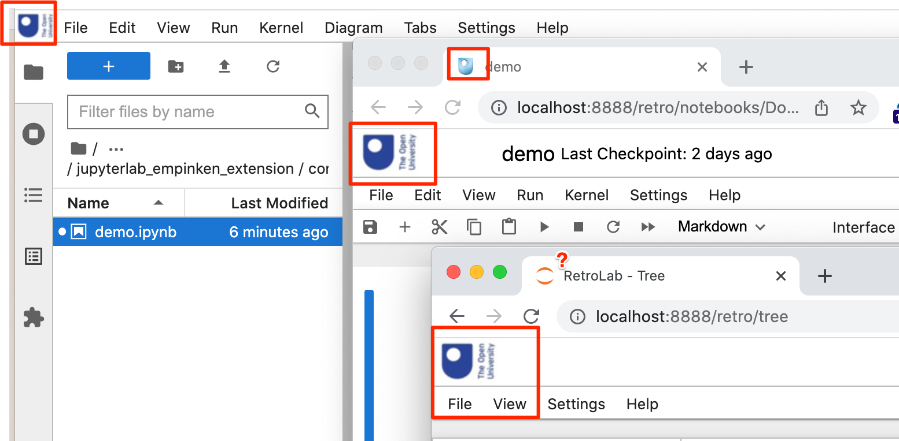

# jupyterlab_ou_brand_extension

Simple extension to apply custom brand logos JupyterLab.

Demo [JupyterLab site via JupyterLite](http://innovationoutside.github.io/jupyterlab_ou_brand_extension/)
Demo [Retroab / notebook v.7 sie via JupyterLite](http://innovationoutside.github.io/jupyterlab_ou_brand_extension/retro)

To install the prebuilt extension from a wheel:

`pip3 install --upgrade https://raw.githubusercontent.com/innovationOUtside/jupyterlab_ou_brand_extension/main/dist/jupyterlab_ou_brand_extension-0.1.0-py3-none-any.whl`

Custom logos applied to:

- JupyterLab IDE
- RetroLab homepage
- RetroLab notebooks
- favicons

